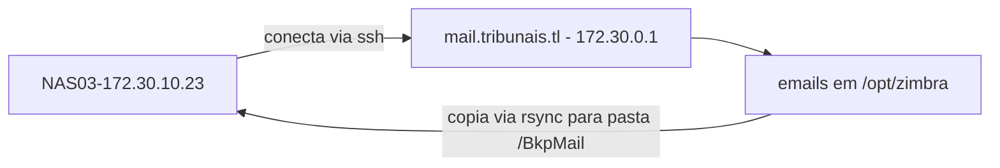
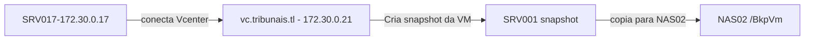

# SRV001 

Documentação inicial do servidor de **email** dos tribunais.


## Configuração

| Os | IP | DNS Name | Vcenter Host | CPU | Memory GB|
| ------ | ------ | ----- | -----| -----| -----| 
| CentOS 7 (64-bit) | 172.30.0.1 | https://mail.tribunais.tl | 172.30.10.9 | 8 | 8

Outros aliases:

- http://srv001.tribunais.tl


## Discos

| HD1 | HD2 |
| ------ | ------ | 
| 1 TB | | 

## Acesso externo
 - Servidor possui acesso externo via NAT 1:1 no firewall
 - Não passa pelo Nginx Proxy Reverso 172.30.0.6

## Segurança
habilitado security headers no servidor

```
su zimbra
zmprov mcf +zimbraResponseHeader "Strict-Transport-Security: max-age=31536000; includeSubDomains"
zmprov mcf +zimbraResponseHeader "X-XSS-Protection: 1; mode=block"
zmprov mcf +zimbraResponseHeader "X-Content-Type-Options: nosniff"
zmprov mcf +zimbraResponseHeader "X-Robots-Tag: noindex"
zmprov mcf zimbraMailKeepOutWebCrawlers TRUE
zmmailboxdctl restart
```
  
## Aplicações
-----

### Zimbra mail server
Versão :
- Zimbra 8.8.15_GA_3847 (build 20190823100304)

### Certbot 
Renovação de certificado ssl para https no servidor

Instalar certbot : https://certbot.eff.org/ - Referência

``
yum -y install certbot
``

Verificar versão :  

``
certbot --version
``

## Certificado SSL
---
O script gera certificado e salva no seguinte diretório:
```
/opt/zimbra/ssl/letsencrypt/
```

## Agendamentos crontab
---
O servidor possui um agendamento para renovar o certificado SSL-HTTPS do Zimbra.

`
crontab -e 
`

`
12 5 * * * root /opt/scripts/renew_certificate.sh
`

## Scripts
---
Por padrão, os servidores do tribunal usam o caminho /opt para scripts necessários.
 - função: atualizar certificado do servidor de e-mail:

`
/opt/scripts/renew_certificate.sh
`

O script possui uma cópia no seguinte repositório: 

https://git.tribunais.tl/infra/scripts/-/blob/master/SSL_CERT/renew_certificate.sh

## Mapeamentos NFS
---
Não aplicável

## Backup
---
O servidor de email tem dois esquemas de backup programados:

 - Caixas postais dos usuários ou mailbox via rsync
 - backup inteiro da VM via snapshot online

### Backup para NAS - rsync
- Backup via Rsync
- SERVIDOR DE BACKUP : NAS03
- APLICAÇÃO : ACTIVE BACKUP FOR BUSINESS
- TASK : Backup Zimbra mailboxes - Mirror
- Destino backup : NAS03 
- Folder : BkpMail
- Agendamento : Diário
- Hora: 03:00 am (madrugada).

### Esquema de backup -rsysnc



### Restauração backup - rsysnc
Abra o ACTIVE BACKUP FOR BUSINESS no servidor NAS-03 e inicie o proceso de recuperação:


### Backup para NAS - vm
- Backup via Snapshot 
- SERVIDOR DE BACKUP : 172.30.0.17
- APLICAÇÃO : MICROFOCUS VME
- TASK : Backup of SRV001
- Destino backup : NAS02
- Pasta : BkpVm
- Agendamento : Semanal
- Dia da semana : Domingo
- Hora: 00:00 am (madrugada).

### Esquema de backup - vm



### Restauração backup - vm
Vá para o servidor de backup 172.30.0.17

Abra o MICROFOCUS VME no servidor e inicie o processo de recuperação:

1 - Abra a aplicação microfocus
<http://127.0.0.1> 


2 - Escolha as opções de restauração.

  - Você pode restaurar copias a nivel de arquivo/pasta ou simplesmente restaurar uma VM inteira.


