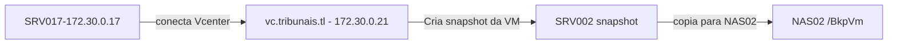

# SRV002  

Documentação inicial do servidor de **domínio** dos tribunais.

Este servidor é o controlador de domínio nos tribunais, reponsável pelo gerenciamento de indentidades dos usuários e integração com outras aplicações.

## Configuração

| Os | IP | DNS Name | Vcenter Host | CPU | Memory GB|
| ------ | ------ | ----- | -----| -----| -----|
| Debian 9 (64-bit) | 172.30.0.2 | portal.tribunais.tl | 172.30.10.4 | 4 | 8

Outros aliases:

- http://srv002.tribunais.tl

- http://dc.tribunais.tl

## Discos

| HD1 | HD2 |
| ------ | ------ |
| 60 GB | |

## Aplicações

-----

### Univention Corporate Server

Versão :

- Univention 4.4-8 errata1044 (Blumenthal)

- UMC Version - 11.0.6-17A~4.4.0.202108311507

### Certificado SSL

Renovação de certificado ssl para https no servidor:

- Vence somente em 2024

- Tipo do certificado - Auto assinado

## Agendamentos crontab

---

Não aplicável

## Scripts

---

Não aplicável

## Mapeamentos NFS

---

Não aplicável

## Backup

---

- Backup via snapshot VM
- SERVIDOR DE BACKUP : 172.30.0.17
- APLICAÇÃO : MICROFOCUS VME
- TASK : Backup of SRV002
- Destino backup : NAS02
- Pasta : BkpVm
- Agendamento : Semanal
- Dia da semana : Terça
- Hora: 04:00 am (madrugada).

### Esquema de backup

### Restauração backup
Vá para o servidor de backup 172.30.0.17

Abra o MICROFOCUS VME no servidor e inicie o processo de recuperação:

1 - Abra a aplicação microfocus
<http://127.0.0.1> 

2 - Escolha as opções de restauração.

  - Você pode restaurar copias a nivel de arquivo/pasta ou simplesmente restaurar uma VM inteira.

