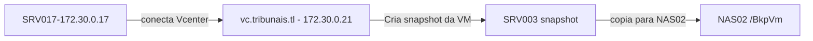

# SRV003

Documentação inicial do servidor onde esta hospedado o **website** dos Tribunais.
Este servidor fornece os serviços de descoberta automática de proxy com WPAD, WEBSITE, TROCA NUC e ATUALIZAÇÃO DE STATUS de um caso.

Este servidor esta atrás de um proxy reverso para maior segurança.
O proxy reverso(SRV006) é encarregado de redirecionar a conexão e atualizar os certificados SSL/HTTPS.

## Configuração

| Os | IP interno | IP exerno | DNS Name | Vcenter Host | CPU | Memory GB|
| ------ | ------ | ----- |----- | -----| -----| -----|
| Debian 10 (64-bit) | 172.30.0.3 | 180.189.162.242 | SRV003 | 172.30.10.3 | 1 | 6

Outros aliases:

- <http://srv003.tribunais.tl>
- <http://wpad.tribunais.tl/>
- <http://caso.tribunais.tl/>
- <http://nuc.tribunais.tl/>
- <https://www.tribunais.tl>

## Discos

| HD1 | HD2 |
| ------ | ------ |
| 100 GB | |

## Aplicações

-----

### Nginx

Versão : nginx/1.14.2

Arquivos de configuração :

```
/etc/nginx/sites-enabled
```

Localização dos arquivos para o website e demais serviços

```
/var/www
```

Neste diretório temos os arquivos de configuração do wordpress e demais aplicações web.

### Wordpress

Versão: 5.6.4

local da instalação :

```
/var/www/tribunais.tl/
```

### Mysql/MariaDB

Versão: 10.3.15-MariaDB-1

Banco de dados para wordpress website

- Nome da base de dados: **site_tribunais**

Banco de dados para os acórdãos

- Nome da base de dados: **site_tribunais_acordaos**

## Certificado SSL

---

Não aplicável

## Agendamentos crontab

---

Não aplicável

## Scripts

---

Por padrão, os servidores do tribunal usam o caminho /opt para scripts necessários.

- Função: fixar as permissões corretas para o wordpress:

`
/opt/scripts/fix_wp_permission.sh
`

O script possui uma cópia no seguinte repositório:

<https://git.tribunais.tl/infra/scripts/-/blob/master/wordpress/fix_wp_permission.sh>

## Mapeamentos NFS

---

Não aplicável

## Backup

---

- Backup via snapshot VM
- SERVIDOR DE BACKUP : 172.30.0.17
- APLICAÇÃO : MICROFOCUS VME
- TASK : Backup of SRV003
- Destino backup : NAS02
- Pasta : BkpVm
- Agendamento : Semanal
- Dia da semana : Segunda
- Hora: 18:00 pm (tarde).

### Esquema de backup



### Restauração backup

Vá para o servidor de backup 172.30.0.17

Abra o MICROFOCUS VME no servidor e inicie o processo de recuperação:

1 - Abra a aplicação microfocus
<http://127.0.0.1>


2 - Escolha as opções de restauração.

- Você pode restaurar copias a nivel de arquivo/pasta ou simplesmente restaurar uma VM inteira.


