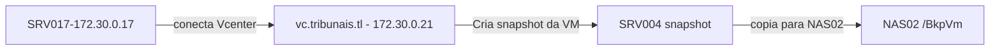

# SRV004

Documentação inicial do servidor **DHCP** dos tribunais.

Este servidor é responsável pela entrega do serviço DHCP, ou seja, os endereços IP's da LAN.

## Configuração

| Os | IP | DNS Name | Vcenter Host | CPU | Memory GB|
| ------ | ------ | ----- | -----| -----| -----|
| Debian 9 (64-bit) | 172.30.0.4 | srv004 | 172.30.10.5 | 1 | 1

## Discos

| HD1 | HD2 |
| ------ | ------ |
| 10 GB | |

## Aplicações

-----

### ISC Dhcp

Local da instalação com o pacote padrão:

```
/etc/dhcp
```

Configuração arquivo dhcpd.conf

```
/etc/dhcp/dhcpd.conf
```

Conteúdo

```
option domain-name "tribunais.tl";
option domain-name-servers dc.tribunais.tl;
option time-offset 32400; # GMT+0900
option local-pac-server code 252 = text;
option local-pac-server "http://wpad.tribunais.tl/wpad.dat";


subnet 172.30.0.0 netmask 255.255.240.0 {
        authoritative;
        range 172.30.0.50 172.30.15.254;
        option subnet-mask 255.255.240.0;
        option broadcast-address 172.30.15.255;
        option routers 172.30.0.5;
        option domain-name-servers 172.30.0.2, 172.30.0.5;
        option domain-name "tribunais.tl";
        option time-offset 32400;
        default-lease-time 21600;
        max-lease-time 43200;
}

```

## Certificado SSL

---

Não aplicável

## Agendamentos crontab

---

Não aplicável

## Scripts

---

Não aplicável

## Mapeamentos NFS

---

Não aplicável

## Backup

---

- Backup via snapshot VM
- SERVIDOR DE BACKUP : 172.30.0.17
- APLICAÇÃO : MICROFOCUS VME
- TASK : Backup of SRV004
- Destino backup : NAS02
- Pasta : BkpVm
- Agendamento : Semanal
- Dia da semana : Quinta
- Hora: 00:00 am (madrugada).

### Esquema de backup



### Restauração backup

Vá para o servidor de backup 172.30.0.17

Abra o MICROFOCUS VME no servidor e inicie o processo de recuperação:

1 - Abra a aplicação microfocus
<http://127.0.0.1>


2 - Escolha as opções de restauração.

- Você pode restaurar copias a nivel de arquivo/pasta ou simplesmente restaurar uma VM inteira.


