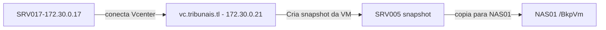

# SRV005

Documentação inicial do servidor **FIREWALL** dos tribunais.

Este servidor é responsável pela proteção da rede e serviços de proxy lan e controle de conteúdo.

## Configuração

| Os | IP LAN | IP WAN | DNS Name | Vcenter Host | CPU | Memory GB|
| ------ |  ------ | ------ | ----- | -----| -----| -----|
| FreeBSD 12 - PFSENSE | 172.30.0.5 | 180.189.168.245 |srv005 | 172.30.10.6 | 4 | 8

| EM0 - LAN | EM1 - WAN |
| ------ | ------ |
| 172.30.0.5 | 180.189.168.245 |

Outros aliases:

- <http://srv005.tribunais.tl>
- <http://firewall.tribunais.tl/>

### Discos

| HD1 | HD2 |
| ------ | ------ |
| 40 GB | |

### Lista de IP's

| IP | TIPO | SERVIÇO |
| ------ | ------ |------ |
|180.189.168.243/32 | 	WAN  	IP Alias | 	DNS-NS2 	
|180.189.168.244/32 | 	WAN  	IP Alias |	DNS-NS1 	
|180.189.168.242/32 |	WAN  	IP Alias | 	WEB     	
|180.189.168.246/32 |	WAN  	IP Alias |	MAIL    

## Aplicações

-----

### PFSENSE Firewall

VERSÃO : 2.5.2-RELEASE (amd64)

- Squid proxy : Controle de acesso a internet e usuários.
- SquidGuard  : Controle de conteúdo e grupos de acesso.
- DNS : Unbound DNS - PFSENSE do tribunal usa DNS resolver.
- pfblockerNG : Controle de acesso, bloqueio de ADS(propaganda) e sites via DNS.
- Telegraf : Envia logs do PFSENSE para o servidor de monitoramento.
- NtopNG : Tráfego e inspeção de pacotes.
- Softflowd : Analisador de tráfego de rede.

### DNS

PFsense do Tribunal direciona resolução interna de nomes para ele mesmo e toda conexão DNS externa usa
DNS seguro QUADDNS(Com sede na suíça).

porta saida externa DNS Seguro : 853

IP's DNS:

| IP |
| ------ |
| 9.9.9.9 |
| 149.112.112.112 |

## Certificado SSL

---

Servidor usa certificado auto-assinado

## Agendamentos crontab

---

Não aplicável

## Scripts

---

Não aplicável

## Mapeamentos NFS

---

Não aplicável

## Backup

---

- Backup via snapshot VM
- SERVIDOR DE BACKUP : 172.30.0.17
- APLICAÇÃO : MICROFOCUS VME
- TASK : Backup of SRV005
- Destino backup : NAS02
- Pasta : BkpVm
- Agendamento : Semanal
- Dia da semana : Sábado
- Hora: 08:00 am (manhã).

### Esquema de backup

### Restauração backup

Vá para o servidor de backup 172.30.0.17

Abra o MICROFOCUS VME no servidor e inicie o processo de recuperação:

1 - Abra a aplicação microfocus
<http://127.0.0.1>

2 - Escolha as opções de restauração.

- Você pode restaurar copias a nivel de arquivo/pasta ou simplesmente restaurar uma VM inteira.

